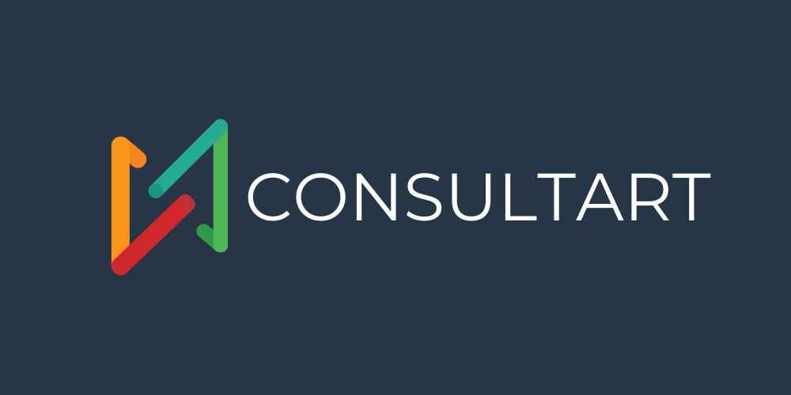
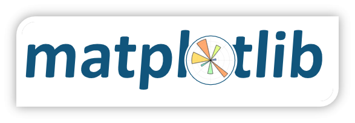
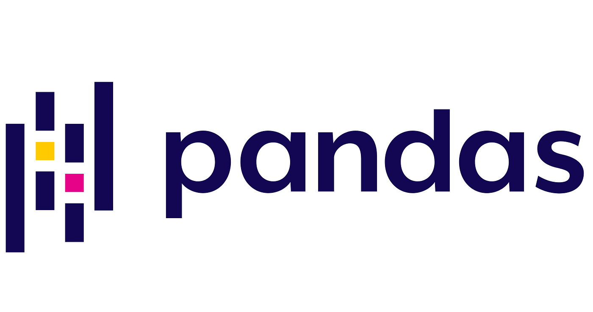
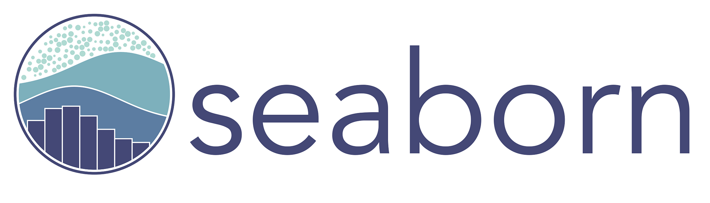
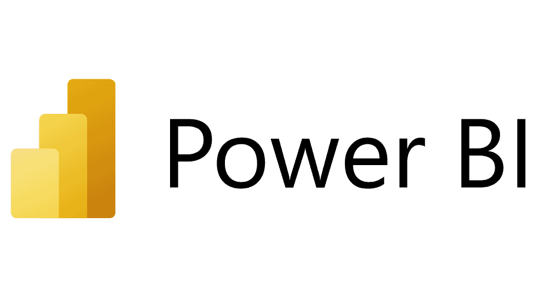
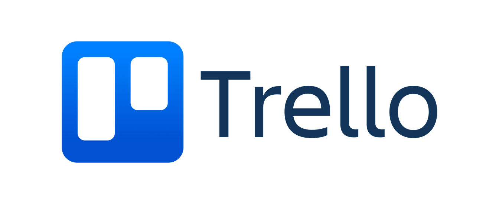
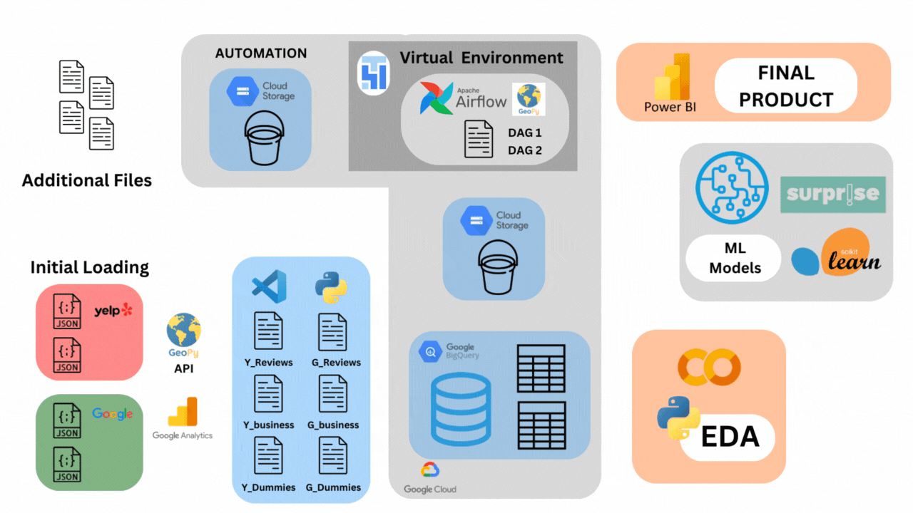
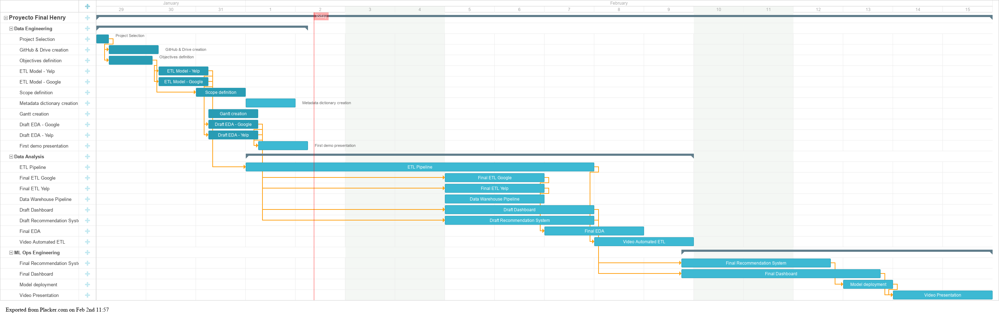

# 
  

# <h1 align=center> **Restaurant Analysis and Consulting Project** </h1>

## Index

  
Content Table

  <ol>
    <li><a href="#Index">Index</a></li>
    <li><a href="#about-the-project">About the Project</a></li>
    <li><a href="#key-performance-indicators">Key Performance Indicators</a></li>
    <li><a href="#selected-technologies">Selected Technologies</a></li>
    <li><a href="#Pipeline">Project Pipeline</a></li>
    <li><a href="#Timeline">Project Timeline</a></li>
    <li><a href="#Analytics-Dashboard">Analytics Dashboard</a></li>
    <li><a href="#Recommendation-System">Recommendation System</a></li>
    <li><a href="#team-members">Team Members</a></li>
  </ol>

## About the Project

### Objective

The primary objective of this project is to simulate a business consulting firm while engaging in a hands-on project. In this scenario, a client approaches us to analyze the opportunities for opening a restaurant somewhere in the state of New York.

### Scope

This project focuses on analyzing data within the states of California, New York, Texas, Florida & Pennsylvania during the period from 2016 to 2021. The mentioned States where chosen because of its mayor population, you can see the step guide [here](Data%20Engineering/Scope.ipynb)

### Step-by-Step Guide

#### Step 1: ETL (Extraction, Transformation, and Loading)

Relevant data about restaurants, reviews, and other key metrics are collected while using the [Google Maps](https://drive.google.com/drive/folders/1Wf7YkxA0aHI3GpoHc9Nh8_scf5BbD4DA) and the [Yelp](https://drive.google.com/drive/folders/1TI-SsMnZsNP6t930olEEWbBQdo_yuIZF) provided DataSets.

To check-out the ETL you can click in this [link](/Data%20Engineering/) and see the ETL model analysis.

#### Step 2: Exploratory Data Analysis (EDA)

In this stage, explore and analyze the data to better understand trends and patterns.

To check-out the ETL you can click in this [link](/Data%20Analysis/) and see the ETL model analysis.

#### Step 3: Dashboard

Build a dashboard presenting a full analysis of the data and evolution of key performance indicators (KPIs) defined by the client.

#### Step 4: Recommendation Model

Finally, build a recommendation model to provide our client with a list of restaurants comparable to theirs.

This project aims to provide our client with valuable information for strategic decision-making and a deeper understanding of the local restaurant market.

## Key Performance Indicators

1. **Customer Satisfaction Index:**
   - *Definition:* Annual increase in the proportion of reviews with positive and neutral sentiment compared to the total number of reviews.
   - *Objective:* +10%.

2. **Popularity Index:**
   - *Definition:* Annual increase in the absolute number of reviews.
   - *Objective:* +10%.

3. **Seasonal Growth Index:**
   - *Definition:* Annual increase in the absolute number of visits during peak seasons (April to July).
   - *Objective:* +7%.

4. **Supply Index:**
   - *Definition:* Annual increase in the absolute number of businesses with reviews.
   - *Objective:* +5%.

5. **Market Index:**
   - *Definition:* Annual increase in the average number of reviews.
   - *Objective:* +3%.

## Selected Technologies

| [Python](https://www.python.org/doc/) | [Matplotlib](https://matplotlib.org/stable/contents.html) | [NLTK](https://www.nltk.org/) | [Pandas](https://pandas.pydata.org/pandas-docs/stable/index.html) | [Seaborn](https://seaborn.pydata.org/) | [Surprise](https://surprise.readthedocs.io/en/stable/) |
| ------------------------ | ----------------------- | ----------------------- | ----------------------- | ----------------------- | ----------------------- |
|  |  |  |  |  |  |

| [Google Cloud](https://cloud.google.com/storage/docs?hl=es-419) | [Power BI](https://docs.microsoft.com/en-us/power-bi/) | [Trello](https://trello.com/) | [StreamLit](https://docs.streamlit.io/) | [AirFlow](https://airflow.apache.org/docs/) | [BigQuery](https://cloud.google.com/bigquery/docs?hl=es-419) |
| ----------------------- | ----------------------- | ----------------------- | ----------------------- | ----------------------- | ----------------------- |
|  |  |  |  |  |  |

## Pipeline

## Timeline

## Analytics Dashboard

## Recommendation System

The recommendation system is based in two user-linked systems:

### Identify your Competition

<b>Why is it important?</b>

- **Who Are Our Competitors?** 🔍
  Understanding who your competitors are is crucial for success in the restaurant industry. Our machine learning model helps you identify and analyze your competitors.

- **What Defines the Local Market?** 🏙️
  Every restaurant operates within a unique local market. Our model considers various factors to help you understand the dynamics of your specific market.

- **How Developed is the Market?** 📈
  Assessing the level of development in your market can provide valuable insights for strategic decision-making. Our model evaluates market maturity and competitiveness.

- **What Sets Us Apart?** 🚀
  While knowing your competitors is essential, it's equally important to understand your unique value proposition. Our model helps you identify your strengths and points of differentiation.

### Understanding Your Audience

<b>Why is it important?</b>

- **What is Our Target Audience?** 🎯
  Understanding your target audience is essential for effective marketing strategies. Our model helps you identify and analyze the characteristics of your audience.

- **How Do We Create Brand Identity?** 🌟
  Building a strong brand identity is crucial for connecting with your audience and standing out in the market. Our model provides insights and recommendations for brand development.

- **How Can Design Orient Us?** 🎨
  Design plays a significant role in shaping perceptions and attracting customers. Our model offers guidance on design principles and aesthetics to enhance brand appeal.

- **Are There Essential Attributes?** 💡
  Certain attributes are more impactful than others in influencing consumer behavior. Our model helps you identify and prioritize the key attributes for your brand.

### Ready to Get Started?
Discover your competition and gain insights to drive your restaurant's success!

[Explore the model](https://consultarte.streamlit.app/)

## Team Members

<table align="center">
  <tr>
    <td align="center"><b>Maximiliano Tauil</b></td>
    <td align="center"><b>Sebastian Armijo</b></td>
    <td align="center"><b>Nicolás Pontis Ledda</b></td>
    <td align="center"><b>Lucero Flores</b></td>
    <td align="center"><b>Pedro Franke</b></td>
  </tr>
  <tr>
    <td align="center"></td>
    <td align="center"></td>
    <td align="center"></td>
    <td align="center"></td>
    <td align="center"></td>
  </tr>
  <tr>
    <td align="center">Data Engineer</td>
    <td align="center">Data Engineer</td>
    <td align="center">Data Analyst</td>
    <td align="center">Data Analyst</td>
    <td align="center">ML Ops Engineer</td>
  </tr>
  <tr>
    <td align="center"></td>
    <td align="center"></td>
    <td align="center"></td>
    <td align="center"></td>
    <td align="center"></td>
  </tr>
</table>

