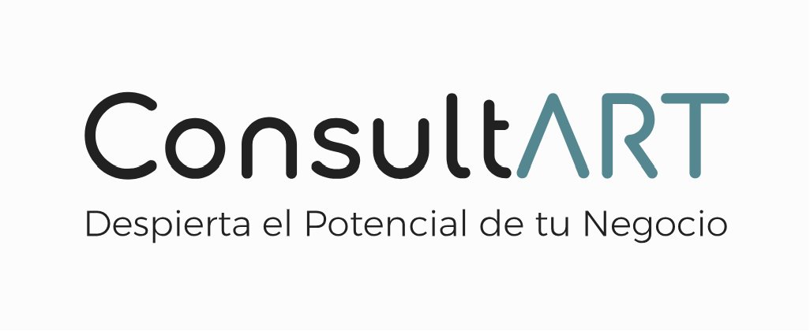

# 
  

# <h1 align=center> **Restaurant Analysis and Consulting Project** </h1>

## Index

  
Content Table

  <ol>
    <li><a href="#Index">Index</a></li>
    <li><a href="#about-the-project">About the Project</a></li>
    <li><a href="#selected-technologies">Selected Technologies</a></li>
    <li><a href="#Pipeline">Project Pipeline</a></li>
    <li><a href="#Timeline">Project Timeline</a></li>
    <li><a href="#team-members">Team Members</a></li>
  </ol>

## About the Project

### Objective

The primary objective of this project is to simulate a business consulting firm while engaging in a hands-on project. In this scenario, a client approaches us to analyze the opportunities for opening a restaurant somewhere in the state of New York.

### Scope

This project focuses on analyzing data within the state of New York during the period from 2016 to 2021. The scope is limited to this geographical area and timeframe as explained in [this](link) analisis.

### Step-by-Step Guide

#### Step 1: ETL (Extraction, Transformation, and Loading)

Relevant data about restaurants, reviews, and other key metrics are collected while using the [Google Maps](https://drive.google.com/drive/folders/1Wf7YkxA0aHI3GpoHc9Nh8_scf5BbD4DA) and the [Yelp](https://drive.google.com/drive/folders/1TI-SsMnZsNP6t930olEEWbBQdo_yuIZF) provided DataSets.

To check-out the ETL you can click in this [link](/Data%20Engineering/) and see the ETL model analysis.

#### Step 2: Exploratory Data Analysis (EDA)

In this stage, explore and analyze the data to better understand trends and patterns.

To check-out the ETL you can click in this [link](/Data%20Analysis/) and see the ETL model analysis.

#### Step 3: Dashboard

Build a dashboard presenting a full analysis of the data and evolution of key performance indicators (KPIs) defined by the client.

#### Step 4: Recommendation Model

Finally, build a recommendation model to provide our client with a list of restaurants comparable to theirs.

This project aims to provide our client with valuable information for strategic decision-making and a deeper understanding of the local restaurant market.

## Selected Technologies

## Pipeline

## Timeline

## Team Members

### Maximiliano Tauil 
Data Engineer

Data engineering, pipeline development

### Nicolás Pontis Ledda (Data Engineer)

Data engineering, pipeline development

### Lucero Flores
Data Analyst

Data analysis, visualization

### Pedro Franke
ML Ops Engineer

Machine learning model, model deployment

