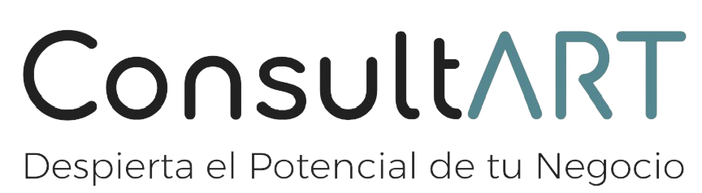

# 
  

# <h1 align=center> **Restaurant Analysis and Consulting Project** </h1>

# <h2 align=left> **About the Project** </h2>

The primary objective of this project is to simulate a business consulting firm while engaging in a hands-on project. In this scenario, a client approaches us to analyze the opportunities for opening a restaurant somewhere in the state of New York.

## Step-by-Step Guide

### Step 1: ETL (Extraction, Transformation, and Loading)

In this phase, relevant data about restaurants, reviews, and other key metrics are collected.

### Step 2: Exploratory Data Analysis (EDA)

In this stage, explore and analyze the data to better understand trends and patterns.

### Step 3: KPI Dashboard Creation

Build a dashboard presenting key performance indicators (KPIs) defined by the client.

#### Main KPIs on the Dashboard:

1. **Positive Reviews Growth:**
   - Definition: Absolute count of positive and neutral reviews.
   - Period: Annual.
   - Goal: +10%.

2. **Visits Growth:**
   - Definition: Absolute count of people with reviews.
   - Period: Annual.
   - Goal: +10%.

3. **Seasonal Growth:**
   - Definition: Absolute count of visits during high season periods (June to August).
   - Goal: +10%.

4. **Business Count Growth:**
   - Definition: Absolute count of businesses with reviews.
   - Period: Annual.
   - Goal: +5%.

5. **Price Category Growth:**
   - Definition: Percentage of businesses with price category 4 or 5 out of the total.
   - Period: Annual.
   - Goal: +3%.

### Step 4: Recommendation Model Creation

Finally, build a recommendation model to provide our client with a list of restaurants comparable to theirs.

This project aims to provide our client with valuable information for strategic decision-making and a deeper understanding of the local restaurant market.

[Instrucciones del proyecto](https://github.com/soyHenry/PF_DS/blob/FULL-TIME/Proyectos/yelp-goople.md)  

Datasets:  
[Yelp](https://drive.google.com/drive/folders/1TI-SsMnZsNP6t930olEEWbBQdo_yuIZF)  
[Google Maps](https://drive.google.com/drive/folders/1Wf7YkxA0aHI3GpoHc9Nh8_scf5BbD4DA)  

## **Desarrollo del trabajo**

