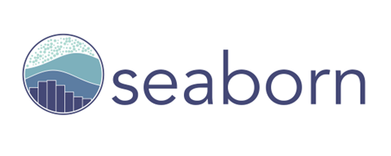

# 
  

# <h1 align=center> **Restaurant Analysis and Consulting Project** </h1>

## Index

  
Content Table

  <ol>
    <li><a href="#Index">Index</a></li>
    <li><a href="#about-the-project">About the Project</a></li>
    <li><a href="#selected-technologies">Selected Technologies</a></li>
    <li><a href="#Pipeline">Project Pipeline</a></li>
    <li><a href="#Timeline">Project Timeline</a></li>
    <li><a href="#team-members">Team Members</a></li>
  </ol>

## About the Project

### Objective

The primary objective of this project is to simulate a business consulting firm while engaging in a hands-on project. In this scenario, a client approaches us to analyze the opportunities for opening a restaurant somewhere in the state of New York.

### Scope

This project focuses on analyzing data within the states of California, New York, Texas, Florida & Pennsylvania during the period from 2016 to 2021. The mentioned States where chosen because of its mayor population, you can see the step guide [here](Scope.ipynb)

### Step-by-Step Guide

#### Step 1: ETL (Extraction, Transformation, and Loading)

Relevant data about restaurants, reviews, and other key metrics are collected while using the [Google Maps](https://drive.google.com/drive/folders/1Wf7YkxA0aHI3GpoHc9Nh8_scf5BbD4DA) and the [Yelp](https://drive.google.com/drive/folders/1TI-SsMnZsNP6t930olEEWbBQdo_yuIZF) provided DataSets.

To check-out the ETL you can click in this [link](/Data%20Engineering/) and see the ETL model analysis.

#### Step 2: Exploratory Data Analysis (EDA)

In this stage, explore and analyze the data to better understand trends and patterns.

To check-out the ETL you can click in this [link](/Data%20Analysis/) and see the ETL model analysis.

#### Step 3: Dashboard

Build a dashboard presenting a full analysis of the data and evolution of key performance indicators (KPIs) defined by the client.

#### Step 4: Recommendation Model

Finally, build a recommendation model to provide our client with a list of restaurants comparable to theirs.

This project aims to provide our client with valuable information for strategic decision-making and a deeper understanding of the local restaurant market.

## Selected Technologies

  
  
  
  
  
  
  
  

## Pipeline

## Timeline

## Team Members

<table align="center">
  <tr>
    <td align="center"><b>Maximiliano Tauil</b></td>
    <td align="center"><b>Sebastian Armijo</b></td>
    <td align="center"><b>Nicolás Pontis Ledda</b></td>
    <td align="center"><b>Lucero Flores</b></td>
    <td align="center"><b>Pedro Franke</b></td>
  </tr>
  <tr>
    <td align="center"></td>
    <td align="center"></td>
    <td align="center"></td>
    <td align="center"></td>
    <td align="center"></td>
  </tr>
  <tr>
    <td align="center">Data Engineer</td>
    <td align="center">Data Engineer</td>
    <td align="center">Data Analyst</td>
    <td align="center">Data Analyst</td>
    <td align="center">ML Ops Engineer</td>
  </tr>
  <tr>
    <td align="center"></td>
    <td align="center"></td>
    <td align="center"></td>
    <td align="center"></td>
    <td align="center"></td>
  </tr>
</table>

